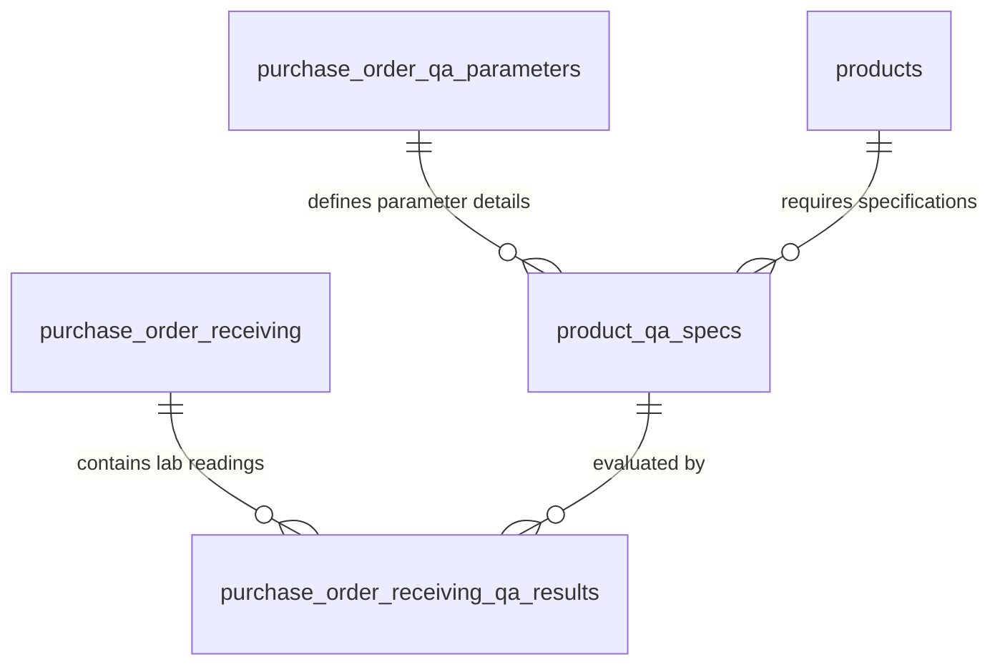

# 📋 Technical Specification: Purchase Order, Approval, & QA Receiving Architecture

This document defines the architectural specification, database schemas, and codebase structure for Purchase Order management, workflow approvals, and quality control receiving in the VOS Manufacturing ERP. 

To ensure strict separation of concerns, role-based access control (RBAC), and clean code structure, this system is divided into **three separate codebase modules**:
1.  **Purchase Order Module** (`src/modules/manufacturing-management/purchase-order`): For procurement encoding, line entry, and pricing/currency locking.
2.  **Purchase Order Approval Module** (`src/modules/manufacturing-management/purchase-order-approval`): For manager and finance sign-offs.
3.  **QA Receiving Module** (`src/modules/manufacturing-management/qa-receiving`): For combined physical check-in, dynamic checklist testing, and immediate ledger movements.

---

## 🔄 Integrated Manufacturing Lifecycle & Module Boundaries

Raw material quality directly impacts finished product safety and yield. The system coordinates operations across three separate modules:

```
                  +-------------------------------------------------------------+
                  |                 1. PURCHASE ORDER MODULE                    |
                  |  - Consolidates MRP Requisitions                            |
                  |  - Encodes PO Lines, Lock Prices, Discounts, & VAT          |
                  |  - Captures & Locks Foreign Exchange (Forex) Rates          |
                  +-------------------------------------------------------------+
                                                 |
                                                 v
                  +-------------------------------------------------------------+
                  |             2. PURCHASE ORDER APPROVAL MODULE               |
                  |  - Dynamic workflow queue based on PO value & category       |
                  |  - Handles Operational (Plant) & Financial approvals        |
                  +-------------------------------------------------------------+
                                                 |
                                                 v
                  +-------------------------------------------------------------+
                  |                    3. QA RECEIVING MODULE                   |
                  |  - Unified Dock Gate check-in & physical receipt logging    |
                  |  - Retrieves dynamic QA Specs checklist per raw material    |
                  |  - Performs Lab Assays & submits Pass/Fail dispositions     |
                  |  - Automatically creates inventory lots (Passed/Rejected)   |
                  |  - Executes immediate ledger writes to inventory movements   |
                  +-------------------------------------------------------------+
```

### 1. Purchase Order Module (Procurement Officers)
*   **Drafting**: Consolidates Material Requirements Planning (MRP) shortages. Line items are registered with a `purchase_intent` (either `MRP_Demand` linked to a `job_order_id`, or `Buffer_Stock` for safety buffers).
*   **Cost & Currency Locking**: Encodes prices, discounts, and taxes. Locks the `exchange_rate` and `total_foreign_currency` at the time of creation.

### 2. Purchase Order Approval Module (Plant Managers & Finance)
*   **Workflow Queue**: Approvers inspect pending orders.
*   **Tiers**: Operational sign-off releases standard orders, while financial verification by `finance_id` releases high-value imports.

### 3. QA Receiving Module (Inspectors & Receivers)
*   **Dynamic Checklists**: The system pulls product testing criteria (e.g. moisture limits for flour) from `product_qa_specs`.
*   **Inspection & Split Log**: The inspector logs actual lab results in the same step as physical entry, logging accepted quantities (`received_quantity`) and rejected quantities (`quantity_rejected`).
*   **Immediate Inventory Movements**: Saving the form inserts the receiving record and dynamically triggers immediate inventory writes:
    *   *Passed Lots*: Placed in `inventory_lots` (status = `Passed`) at the target branch, writing a positive adjustment to `inventory_movements`. If MTO, the lot is pre-allocated to the `job_order_id`.
    *   *Rejected Lots*: Placed in `inventory_lots` (status = `Rejected`) under the **Bad Order (BO) branch** (e.g., branch ID 182), writing a positive adjustment to `inventory_movements` at the BO branch.

---

## 🗄️ Database Schema Mapping

This system reuses the company's existing relational tables for core procurement, while introducing supplementary schemas to support dynamic QA checklists, test logging, and inventory movements:

### 1. Existing Production Tables
The system utilizes the following existing tables exactly as defined in the database:

#### A. Suppliers Master (`suppliers`)
```sql
CREATE TABLE `suppliers` (
	`id` INT NOT NULL AUTO_INCREMENT,
	`supplier_name` VARCHAR(255) NOT NULL,
	`supplier_shortcut` VARCHAR(255) NULL DEFAULT NULL,
	`contact_person` VARCHAR(255) NULL DEFAULT NULL,
	`email_address` VARCHAR(255) NULL DEFAULT NULL,
	`phone_number` VARCHAR(20) NULL DEFAULT NULL,
	`address` VARCHAR(255) NULL DEFAULT NULL,
	`city` VARCHAR(100) NULL DEFAULT NULL,
	`brgy` VARCHAR(100) NULL DEFAULT NULL,
	`state_province` VARCHAR(100) NULL DEFAULT NULL,
	`postal_code` VARCHAR(20) NULL DEFAULT NULL,
	`country` VARCHAR(100) NOT NULL,
	`supplier_type` VARCHAR(255) NOT NULL,
	`tin_number` VARCHAR(255) NULL DEFAULT NULL,
	`bank_details` VARCHAR(255) NULL DEFAULT NULL,
	`payment_terms` VARCHAR(255) NULL DEFAULT NULL,
	`delivery_terms` VARCHAR(255) NULL DEFAULT NULL,
	`agreement_or_contract` TEXT NULL DEFAULT NULL,
	`preferred_communication_method` VARCHAR(255) NULL DEFAULT NULL,
	`notes_or_comments` TEXT NULL DEFAULT NULL,
	`date_added` DATE NOT NULL,
	`supplier_image` TEXT NULL DEFAULT NULL,
	`isActive` TINYINT NOT NULL DEFAULT '1',
	`nonBuy` BIT(1) NOT NULL DEFAULT (b'1'),
	`user_id` INT NULL DEFAULT NULL,
	PRIMARY KEY (`id`) USING BTREE,
	UNIQUE INDEX `supplier_name` (`supplier_name`) USING BTREE
) ENGINE=InnoDB DEFAULT CHARSET=utf8mb4 COLLATE=utf8mb4_unicode_ci;
```

#### B. Purchase Order Headers (`purchase_order`)
```sql
CREATE TABLE `purchase_order` (
	`purchase_order_id` INT NOT NULL AUTO_INCREMENT,
	`purchase_order_no` VARCHAR(50) NOT NULL DEFAULT '',
	`reference` VARCHAR(255) NULL DEFAULT NULL,
	`remark` VARCHAR(255) NULL DEFAULT NULL,
	`barcode` VARCHAR(50) NULL DEFAULT NULL,
	`supplier_name` INT NOT NULL COMMENT 'FK referencing suppliers.id',
	`receiving_type` INT NOT NULL,
	`payment_type` INT NOT NULL,
	`price_type` VARCHAR(50) NOT NULL,
	`receipt_required` TINYINT(1) NULL DEFAULT NULL,
	`date_encoded` TIMESTAMP NOT NULL,
	`date` DATE NOT NULL,
	`time` TIME NOT NULL,
	`datetime` DATETIME NOT NULL,
	`lead_time_receiving` DATE NULL DEFAULT NULL,
	`lead_time_payment` DATE NULL DEFAULT NULL,
	`gross_amount` DECIMAL(10,2) NULL DEFAULT NULL,
	`withholding_tax_amount` DECIMAL(10,2) NULL DEFAULT NULL,
	`vat_amount` DECIMAL(10,2) NULL DEFAULT NULL,
	`discounted_amount` DECIMAL(10,2) NULL DEFAULT NULL,
	`total_amount` DECIMAL(10,2) NULL DEFAULT NULL,
	`encoder_id` INT NULL DEFAULT NULL,
	`approver_id` INT NULL DEFAULT NULL,
	`receiver_id` INT NULL DEFAULT NULL,
	`finance_id` INT NULL DEFAULT NULL,
	`voucher_id` INT NULL DEFAULT NULL,
	`transaction_type` TINYINT NOT NULL DEFAULT '0',
	`date_approved` DATETIME NULL DEFAULT NULL,
	`date_received` DATETIME NULL DEFAULT NULL,
	`date_financed` DATETIME NULL DEFAULT NULL,
	`date_vouchered` DATETIME NULL DEFAULT NULL,
	`inventory_status` INT NOT NULL DEFAULT '0',
	`payment_status` INT NOT NULL DEFAULT '1',
	`branch_id` INT NULL DEFAULT NULL,
	`is_posted` TINYINT(1) NOT NULL DEFAULT '0',
	PRIMARY KEY (`purchase_order_id`) USING BTREE,
	UNIQUE INDEX `purchase_order_no` (`purchase_order_no`) USING BTREE,
	CONSTRAINT `FK_purchase_order_payment_status` FOREIGN KEY (`payment_status`) REFERENCES `payment_status` (`id`),
	CONSTRAINT `FK_purchase_order_transaction_status` FOREIGN KEY (`inventory_status`) REFERENCES `transaction_status` (`id`),
	CONSTRAINT `purchase_order_branches_id_fk` FOREIGN KEY (`branch_id`) REFERENCES `branches` (`id`)
) ENGINE=InnoDB DEFAULT CHARSET=utf8mb4 COLLATE=utf8mb4_unicode_ci;
```

#### C. Purchase Order Product Lines (`purchase_order_products`)
```sql
CREATE TABLE `purchase_order_products` (
	`purchase_order_product_id` INT NOT NULL AUTO_INCREMENT,
	`purchase_order_id` INT NOT NULL,
	`product_id` INT NOT NULL,
	`ordered_quantity` INT NOT NULL,
	`unit_price` DECIMAL(10,2) NOT NULL,
	`approved_price` DECIMAL(10,2) NULL DEFAULT NULL,
	`discounted_price` DECIMAL(10,2) NULL DEFAULT NULL,
	`vat_amount` DECIMAL(10,2) NULL DEFAULT NULL,
	`withholding_amount` DECIMAL(10,2) NULL DEFAULT NULL,
	`total_amount` DECIMAL(10,2) NULL DEFAULT NULL,
	`branch_id` INT NULL DEFAULT NULL,
	`received` TINYINT NULL DEFAULT NULL,
	`discount_type` INT NULL DEFAULT NULL,
	`gross_amount` DECIMAL(15,2) NULL DEFAULT NULL,
	`discounted_amount` DECIMAL(15,2) NULL DEFAULT NULL,
	`net_amount` DECIMAL(15,2) NULL DEFAULT NULL,
	PRIMARY KEY (`purchase_order_product_id`) USING BTREE,
	UNIQUE INDEX `purchase_order_id_product_id_branch_id` (`purchase_order_id`, `product_id`, `branch_id`) USING BTREE,
	CONSTRAINT `FK_purchase_order_products_purchase_order` FOREIGN KEY (`purchase_order_id`) REFERENCES `purchase_order` (`purchase_order_id`) ON DELETE CASCADE,
	CONSTRAINT `purchase_order_products_discount_type_foreign` FOREIGN KEY (`discount_type`) REFERENCES `discount_type` (`id`) ON DELETE SET NULL
) ENGINE=InnoDB DEFAULT CHARSET=utf8mb4 COLLATE=utf8mb4_unicode_ci;
```

#### D. Merged Receiving Logs (`purchase_order_receiving`)
Tracks physical deliveries, lot codes, QA flags, and landed costs.
```sql
CREATE TABLE `purchase_order_receiving` (
	`purchase_order_product_id` INT NOT NULL AUTO_INCREMENT COMMENT 'Unique Receiving Line ID (Primary Key)',
	`purchase_order_id` INT NOT NULL,
	`product_id` INT NOT NULL,
	`batch_no` VARCHAR(50) NULL DEFAULT NULL COMMENT 'Supplier Batch/Lot Code',
	`lot_id` INT NULL DEFAULT NULL COMMENT 'References lots.lot_id (location/rack/bin)',
	`expiry_date` DATE NULL DEFAULT NULL,
	`received_quantity` INT NOT NULL COMMENT 'Passed/Accepted quantity',
	`unit_price` DECIMAL(10,2) NOT NULL,
	`discounted_amount` DECIMAL(10,2) NOT NULL,
	`discount_type` INT NULL DEFAULT NULL,
	`vat_amount` DECIMAL(10,2) NULL DEFAULT NULL,
	`withholding_amount` DECIMAL(10,2) NULL DEFAULT NULL,
	`total_amount` DECIMAL(10,2) NULL DEFAULT NULL,
	`branch_id` INT NOT NULL COMMENT 'Receiving destination branch',
	`receipt_no` VARCHAR(50) NULL DEFAULT NULL COMMENT 'Receiving ticket / DR number',
	`receipt_type` INT NULL DEFAULT NULL,
	`receipt_date` DATE NULL DEFAULT NULL,
	`received_date` DATETIME NULL DEFAULT NULL,
	`isPosted` TINYINT NOT NULL DEFAULT '0',
	`is_posted_amounts` TINYINT NULL DEFAULT '0',
	`is_reverted` TINYINT NOT NULL DEFAULT '0',
	`qa_status` VARCHAR(255) NULL DEFAULT NULL COMMENT 'Status: Quarantine, Passed, Rejected',
	`quantity_rejected` DECIMAL(10,5) NULL DEFAULT NULL,
	`rejection_reason` VARCHAR(255) NULL DEFAULT NULL,
	`allocated_expense_php` DECIMAL(10,5) NULL DEFAULT NULL,
	`final_landed_unit_cost` DECIMAL(10,5) NULL DEFAULT NULL,
	PRIMARY KEY (`purchase_order_product_id`) USING BTREE,
	UNIQUE INDEX `purchase_order_receiving_purchase_order_id_IDX` (`purchase_order_id`, `product_id`, `branch_id`, `receipt_no`) USING BTREE,
	CONSTRAINT `FK_purchase_order_receiving_discount_type` FOREIGN KEY (`discount_type`) REFERENCES `discount_type` (`id`),
	CONSTRAINT `FK_purchase_order_receiving_lots` FOREIGN KEY (`lot_id`) REFERENCES `lots` (`lot_id`),
	CONSTRAINT `FK_purchase_order_receiving_products` FOREIGN KEY (`product_id`) REFERENCES `products` (`product_id`),
	CONSTRAINT `FK_purchase_order_receiving_purchase_order` FOREIGN KEY (`purchase_order_id`) REFERENCES `purchase_order` (`purchase_order_id`) ON DELETE CASCADE,
	CONSTRAINT `FK_purchase_order_receiving_receipt_type` FOREIGN KEY (`receipt_type`) REFERENCES `sales_invoice_type` (`id`)
) ENGINE=InnoDB DEFAULT CHARSET=utf8mb4 COLLATE=utf8mb4_unicode_ci;
```

#### E. Physical Inventory Ledger (`inventory_movements`)
Logs physical additions and deductions automatically upon Receiving-QA processing.
```sql
CREATE TABLE `inventory_movements` (
	`movement_id` INT NOT NULL AUTO_INCREMENT,
	`product_id` INT NOT NULL,
	`lot_id` INT NOT NULL,
	`branch_id` INT NOT NULL,
	`transaction_type_id` INT NOT NULL,
	`source_document_id` INT NOT NULL COMMENT 'References purchase_order_receiving.purchase_order_product_id',
	`source_document_no` VARCHAR(100) NULL DEFAULT NULL COMMENT 'References purchase_order_receiving.receipt_no',
	`batch_no` VARCHAR(100) NOT NULL,
	`expiry_date` DATE NULL DEFAULT NULL,
	`manufacturing_date` DATE NULL DEFAULT NULL,
	`quantity` DECIMAL(15,4) NOT NULL,
	`created_by` INT NOT NULL,
	`created_at` DATETIME NOT NULL DEFAULT CURRENT_TIMESTAMP,
	`remarks` TEXT NULL DEFAULT NULL,
	PRIMARY KEY (`movement_id`) USING BTREE,
	CONSTRAINT `fk_movement_lot` FOREIGN KEY (`lot_id`) REFERENCES `lots` (`lot_id`),
	CONSTRAINT `fk_movement_product` FOREIGN KEY (`product_id`) REFERENCES `products` (`product_id`),
	CONSTRAINT `fk_movement_transaction_type` FOREIGN KEY (`transaction_type_id`) REFERENCES `inventory_transaction_types` (`transaction_type_id`),
	CONSTRAINT `FK_inventory_movements_user` FOREIGN KEY (`created_by`) REFERENCES `user` (`user_id`)
) ENGINE=InnoDB DEFAULT CHARSET=utf8mb4 COLLATE=utf8mb4_unicode_ci;
```

---

## 🔍 Suggested Database Schemas: Missing QA Checklist & Parameter Specs

To support dynamic QA checklists (where different products require different test parameters, e.g. moisture % vs. seal integrity) on top of the existing tables, the system requires the following three additional tables:



### 1. QA Parameters Master (`purchase_order_qa_parameters`)
Defines the types of laboratory tests available (e.g., moisture, pH, chemical purity).
```sql
CREATE TABLE `purchase_order_qa_parameters` (
    `parameter_id` INT NOT NULL AUTO_INCREMENT,
    `parameter_name` VARCHAR(100) NOT NULL UNIQUE COMMENT 'e.g., Moisture Content, pH level, Gluten Content, Seal Strength',
    `data_type` ENUM('Numeric', 'Boolean', 'Text') NOT NULL DEFAULT 'Numeric' COMMENT 'Determines UI input component',
    `unit_of_measure` VARCHAR(20) NULL DEFAULT NULL COMMENT 'e.g., %, pH, ppm, N/m',
    `description` TEXT NULL DEFAULT NULL,
    PRIMARY KEY (`parameter_id`)
) ENGINE=InnoDB DEFAULT CHARSET=utf8mb4 COLLATE=utf8mb4_unicode_ci;
```

### 2. Product QA Specifications (`product_qa_specs`)
Defines target ranges and pass/fail thresholds for each product.
```sql
CREATE TABLE `product_qa_specs` (
    `spec_id` INT NOT NULL AUTO_INCREMENT,
    `product_id` INT NOT NULL COMMENT 'References products.product_id',
    `parameter_id` INT NOT NULL,
    `target_min` DECIMAL(12,4) NULL DEFAULT NULL COMMENT 'Minimum threshold for numeric tests',
    `target_max` DECIMAL(12,4) NULL DEFAULT NULL COMMENT 'Maximum threshold for numeric tests',
    `expected_text` VARCHAR(100) NULL DEFAULT NULL COMMENT 'Expected reading for boolean/text tests',
    `is_critical` TINYINT(1) NOT NULL DEFAULT '1' COMMENT 'Failing this parameter triggers automatic lot rejection',
    PRIMARY KEY (`spec_id`),
    UNIQUE INDEX `idx_prod_qa_param` (`product_id`, `parameter_id`),
    CONSTRAINT `FK_product_qa_specs_product` FOREIGN KEY (`product_id`) REFERENCES `products` (`product_id`) ON DELETE CASCADE,
    CONSTRAINT `FK_product_qa_specs_parameter` FOREIGN KEY (`parameter_id`) REFERENCES `purchase_order_qa_parameters` (`parameter_id`) ON DELETE RESTRICT
) ENGINE=InnoDB DEFAULT CHARSET=utf8mb4 COLLATE=utf8mb4_unicode_ci;
```

### 3. QA Analytical Results (`purchase_order_receiving_qa_results`)
Records the actual laboratory readings, linking directly to the existing receiving detail line.
```sql
CREATE TABLE `purchase_order_receiving_qa_results` (
    `result_id` INT NOT NULL AUTO_INCREMENT,
    `receiving_line_id` INT NOT NULL COMMENT 'References purchase_order_receiving.purchase_order_product_id',
    `spec_id` INT NOT NULL COMMENT 'References product_qa_specs.spec_id',
    `actual_reading` VARCHAR(100) NOT NULL COMMENT 'Reading submitted by dock inspector',
    `is_passed` TINYINT(1) NOT NULL DEFAULT '1' COMMENT '0 = Failed spec, 1 = Met spec',
    PRIMARY KEY (`result_id`),
    CONSTRAINT `FK_qa_results_receiving_line` FOREIGN KEY (`receiving_line_id`) REFERENCES `purchase_order_receiving` (`purchase_order_product_id`) ON DELETE CASCADE,
    CONSTRAINT `FK_qa_results_spec` FOREIGN KEY (`spec_id`) REFERENCES `product_qa_specs` (`spec_id`) ON DELETE RESTRICT
) ENGINE=InnoDB DEFAULT CHARSET=utf8mb4 COLLATE=utf8mb4_unicode_ci;
```

---

## 📝 Front-End Development Requirements: Inventory Movements Payload

Because the backend API for posting `inventory_movements` is currently under development by the backend team, the frontend developer must **pre-structure the payloads as JSON** and **provide a payload verification modal** inside the UI.

### 1. Verification Modal Flow
1. When the operator clicks "Submit Receiving & QA" on the unified receiving form inside `qa-receiving`, the application intercepts the submission.
2. A **Ledger Movement Verification Modal** opens, showing the generated JSON payloads in a formatted grid.
3. The operator reviews:
   * **Good Stock Entry**: Quantity, lot codes, expiration dates, and destination plant.
   * **Bad Order Entry** (if any): Rejected quantity routed to the Bad Order quarantine branch (e.g. branch ID 182).
4. After visual confirmation, clicking "Confirm Ledger Writes" submits the payload.

### 2. Standard JSON Payload Specifications

For every row processed on the receiving form, the frontend must generate the following payloads:

#### A. Passed Stock Movement Payload (Generated if `received_quantity` > 0)
```json
{
  "product_id": 412,
  "lot_id": 5589, // The auto-generated or verified physical inventory lot ID
  "branch_id": 12, // Destination warehouse/plant ID
  "transaction_type_id": 1, // Represents 'Purchase Receipt / QA Pass'
  "source_document_id": 22994, // purchase_order_receiving.purchase_order_product_id
  "source_document_no": "REC-2026-0915A", // receipt_no
  "batch_no": "LOT-COCOS-202607-01", // supplier batch code
  "expiry_date": "2027-07-15",
  "manufacturing_date": "2026-07-15",
  "quantity": 250.0000, // Positive fractional quantity
  "created_by": 84, // active user_id of the inspector/receiver
  "remarks": "Passed dynamic QA check. Parameters met: Free Fatty Acids 0.05%, Moisture 0.10%. Available for Job Order allocation."
}
```

#### B. Rejected Stock Movement Payload (Generated if `quantity_rejected` > 0)
```json
{
  "product_id": 412,
  "lot_id": 5590, // Newly registered bad order lot ID
  "branch_id": 182, // Co-located Bad Order / Quarantine branch ID
  "transaction_type_id": 2, // Represents 'QA Reject / Bad Order Receipt'
  "source_document_id": 22994, // purchase_order_receiving.purchase_order_product_id
  "source_document_no": "REC-2026-0915A",
  "batch_no": "LOT-COCOS-202607-01",
  "expiry_date": "2027-07-15",
  "manufacturing_date": "2026-07-15",
  "quantity": 15.0000, // Quantity rejected, logged as a positive entry under the Bad Order branch ledger
  "created_by": 84,
  "remarks": "Rejected: Free Fatty Acid level of 0.28% exceeds critical max specification of 0.10%. Routed to BO warehouse."
}
```

---

## 💻 Codebase Directories & Module Separation

To maintain Role-Based Access Control (RBAC) and codebase cleanliness, the workflow is distributed across three separate modules under `src/modules/manufacturing-management/`:

### 1. Purchase Order Module
*   **Directory**: `src/modules/manufacturing-management/purchase-order/`
*   **Components**:
    *   `PurchaseOrderModule.tsx`: List and entry portal for purchasing officers.
    *   `components/CreatePOMode.tsx`: Wizard for encoding drafts, picking raw materials, selecting billing currencies, and locking forex conversion factors.
    *   `hooks/usePurchaseOrder.ts`: Dedicated hook for managing PO line adjustments and headers.

### 2. Purchase Order Approval Module
*   **Directory**: `src/modules/manufacturing-management/purchase-order-approval/` (or integrated within `src/modules/manufacturing-management/approval/`)
*   **Components**:
    *   `POApprovalInbox.tsx`: Displays list of POs under "For Approval" state (`inventory_status = 3` or `payment_status = 1` checks).
    *   `components/POVerificationPanel.tsx`: Enables plant manager or finance users to inspect PO details, check budget alignment, and trigger patch requests setting `approver_id`/`finance_id`.

### 3. QA Receiving Module
*   **Directory**: `src/modules/manufacturing-management/qa-receiving/`
*   **Components**:
    *   `QAReceivingModule.tsx`: Combined command center for receiving docks and inspectors.
    *   `components/POReceivingQAForm.tsx`: Unified gate check-in and dynamic QA checklist. Fetches spec requirements on-the-fly and displays fields for actual test parameters.
    *   `components/MovementPayloadModal.tsx`: Intercepts form submission and renders the generated `inventory_movements` JSON payloads for user confirmation.
    *   `hooks/useQAReceiving.ts`: Handles receiving state, dynamic QA spec lookups, and lot creation.
