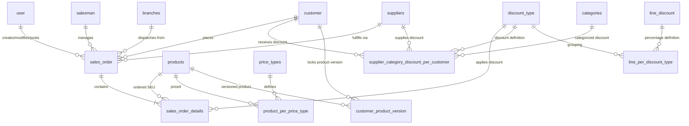

# 📋 Sales Ordering Documentation: Manufacturing & Logistics Alignment

This document outlines the **Sales Ordering System** architecture, workflow, and data structures tailored for the VOS Manufacturing & Logistics ERP. It details how the sales pipeline interfaces with the **Planning & Scheduling (MRP)**, **Shop Floor Execution**, **Quality Assurance (QA)**, and **Logistics Dispatch** modules, and highlights critical schema gaps for review before implementation.

---

## 🔄 End-to-End Sales Order Lifecycle in Manufacturing

Unlike standard retail or e-commerce ordering, a manufacturing Sales Order (SO) represents **demand signals** that directly drive production schedules, material requirements planning (MRP), and machine allocations.

```
+--------------------------------------------------------------------------------------------------+
|                                    OPERATIONAL LIFECYCLE FLOW                                    |
+-------------------+      +-------------------+      +-------------------+      +-----------------+
|  1. Capture &     | ---> |  2. Validation &  | ---> |  3. MRP &         | ---> |  4. Shop Floor  |
|  Pricing Engine   |      |  Credit Check     |      |  Consolidation    |      |  Production     |
+-------------------+      +-------------------+      +-------------------+      +-----------------+
                                                                                                  |
                                                                                                  v
+-------------------+      +-------------------+      +-------------------+      +-----------------+
|  8. Fulfill &     | <--- |  7. QA Release    | <--- |  6. Lot Output &  | <--- |  5. QA Checklist|
|  Route Optimize   |      |  & Inventory Upd  |      |  Quarantine Hold  |      |  Inspection     |
+-------------------+      +-------------------+      +-------------------+      +-----------------+
```

### 1. Capture & Pricing Engine
*   **Trigger**: A sales representative creates a Sales Order manually (via the `/mm/sales-order` client UI) or converts it 1:1 from an approved, simulated customer Quotation.
*   **Pricing Resolution**:
    *   The system reads the customer's `price_type_id` from the `customer` table.
    *   It fetches the customized price for the finished good from `product_per_price_type`. If none is defined, it falls back to `products.price_per_unit`.
*   **Discount Engine Hierarchy**:
    1.  **Line-level Specific Discount**: If a rule exists in `supplier_category_discount_per_customer` matching the `customer_code`, product's `supplier_id`, and `product_category`, the system applies the associated `discount_type`.
    2.  **Customer-level Default Discount**: If no category-specific discount exists, the system falls back to `customer.discount_type`.
    3.  **Manual Override**: Sales managers can apply a flat `discount_amount` on the order header, validated to ensure it does not exceed the order subtotal.

### 2. Validation & Credit Check
*   The system checks the customer's `isActive` flag, `payment_term`, and credit standing.
*   The SO is created in a `Draft` state. Once finalized, the sales representative submits it for approval.
*   The status transitions to `For Approval`. System admins or credit managers approve the order, changing the status to `For Consolidation`.

### 3. MRP & Consolidation Lane
*   **MRP Lane**: The MRP engine (`/mm/planning-engineering`) scans approved sales order items and checks raw material availability.
*   **Batch Consolidation**: Planners group items of the same product across different Sales Orders into a single, unified Job Order (`manufacturing_job_orders`) to minimize machine downtime, changeover cleanings, and setup costs.
*   **Job Order Allocations**: Quantities are linked using a junction table mapping the sales order detail lines to the newly created production Job Order.

### 4. Shop Floor & QA Gates Execution
*   Operators fetch tasks for the released Job Order from the floor dashboard (`/mm/production-workflow`).
*   During production, QA Inspectors enforce checklist approvals at critical machine routing steps (mixing, baking, packing).
*   Production cannot proceed to the next step unless the current step is signed off as `Passed`.

### 5. Lot Output & Quarantine Release
*   Upon shift closure, the supervisor records the final yield quantity, creating a new lot in `inventory_lots` with a `Pending` (Quarantined) status.
*   The raw materials consumed are deducted, and the finished goods yield is added in `inventory_movements` as a ledger entry.
*   The final QA Inspector runs microbiological and chemical assays on the lot. Once approved, the lot status is patched to `Passed` in `inventory_lots`, unlocking it for shipping.

### 6. Logistics, Invoicing, & Routing Optimization
*   Once inventory is released, the Sales Order status advances to `For Picking` and then `For Invoicing` / `For Shipping`.
*   Schedulers group the deliveries, and the Nearest-Neighbor Route Optimizer calculates the most efficient vehicle paths using customer geocodes (`latitude`, `longitude`) and Haversine distance formulas.
*   Upon delivery, drivers upload Proof of Delivery (POD) signatures, updating the SO status to `Delivered`.

---

## 🗄️ Database Schemas Mapping

### System Database Schema


---

## 🔍 Database Schema Analysis: Critical Gaps & Missing Columns

After evaluating the provided MySQL schemas against manufacturing and logistics best practices, several critical gaps have been identified. Review these architectural issues before beginning implementation:

### 1. Missing BOM Version Linkage in Sales Order Details
*   **Problem**: In manufacturing, a product code can have multiple recipe versions (e.g., `V1` for standard production, `V2` with alternative raw materials or cost-saving adjustments). Currently, the system resolves versions dynamically at query time (`_read.ts`) by checking the active version or customer-specific overrides in `customer_product_version`.
*   **Impact**: If a customer's specific BOM version changes *after* a Sales Order is placed, querying that historical Sales Order will dynamically show the new version. This breaks auditing and causes production discrepancies, as the factory floor might produce the order using the wrong recipe.
*   **Recommendation**: Add `bom_version_id` directly to `sales_order_details` to freeze the recipe version at the moment the sales contract is generated or approved.

### 2. Missing Job Order Allocation Junction Table
*   **Problem**: In a consolidated production system, there is a **many-to-many (M:N)** relationship between Sales Orders and Job Orders. One production run (Job Order) can serve multiple Sales Orders, and one large Sales Order might be split across multiple production batches.
*   **Impact**: The provided SQL schema lacks a junction table to track these linkages. Without it, the scheduling dashboard cannot trace which Sales Order lines are scheduled, how much of a line item's quantity is allocated to which batch, or when a specific SO item is completed on the floor.
*   **Recommendation**: Define and implement a `manufacturing_job_order_allocations` table to track this connection.

### 3. Missing Manufacturing Lead Time & Feasibility Validation
*   **Problem**: `sales_order` records a `delivery_date` and a `due_date`. However, there are no fields in the `products` table tracking manufacturing setup time, standard run-rates, or cumulative lead times (except a static `production_capacity_per_hour`).
*   **Impact**: Sales representatives can place orders with delivery dates that are physically impossible for the shop floor to meet. The system cannot perform basic "Available-to-Promise" (ATP) or "Capable-to-Promise" (CTP) validations during SO entry.
*   **Recommendation**: Add standard manufacturing lead days to the product table or calculate realistic due dates based on active machine routings.

### 4. Binary Delivery Status Limitation
*   **Problem**: The `sales_order` table uses a binary bit field `isDelivered` BIT(1).
*   **Impact**: In manufacturing, large orders are frequently shipped in partial batches (split-deliveries) as they come off the production line. A binary flag cannot represent a `Partially Delivered` state. The order status enum includes `Delivered` and `En Route`, but lacks granular tracking for partial shipments.
*   **Recommendation**: Deprecate `isDelivered` in favor of tracking served vs. ordered quantities on line items and matching them with partial logistics dispatch plans.

### 5. Multi-Currency and Forex Rate Locking
*   **Problem**: Pricing and raw material costs are highly sensitive to exchange rates (e.g., raw oil materials priced in USD vs. domestic sales in PHP).
*   **Impact**: There is no mechanism in `sales_order` to lock the currency exchange rate at the time of order placement. Changes in foreign exchange rates between order creation and raw material procurement can silently erase profit margins.
*   **Recommendation**: Add currency and transaction exchange rate columns to `sales_order` to lock margins.

---

## 🛠️ Proposed DDL Schema Modifications

Below are the recommended SQL structural changes to resolve these issues:

### A. Freeze BOM Recipe Version on Sales Order Line Items
```sql
ALTER TABLE `sales_order_details` 
ADD COLUMN `bom_version_id` INT NULL DEFAULT NULL COMMENT 'References product_manufacturing_version' AFTER `product_id`,
ADD CONSTRAINT `FK_sales_order_details_bom_version` 
FOREIGN KEY (`bom_version_id`) REFERENCES `product_manufacturing_version` (`version_id`) 
ON UPDATE NO ACTION ON DELETE RESTRICT;
```

### B. Implement the Job Order Allocation Table (Missing M:N Table)
```sql
CREATE TABLE `manufacturing_job_order_allocations` (
    `id` INT NOT NULL AUTO_INCREMENT,
    `sales_order_detail_id` INT NOT NULL,
    `job_order_id` INT NOT NULL,
    `allocated_quantity` INT NOT NULL DEFAULT '0' COMMENT 'Quantity assigned to this production batch',
    `created_by` INT NULL DEFAULT NULL,
    `created_at` TIMESTAMP NOT NULL DEFAULT CURRENT_TIMESTAMP,
    PRIMARY KEY (`id`),
    UNIQUE INDEX `idx_sod_jo_unique` (`sales_order_detail_id`, `job_order_id`),
    CONSTRAINT `FK_mjoa_sales_order_detail` FOREIGN KEY (`sales_order_detail_id`) REFERENCES `sales_order_details` (`detail_id`) ON DELETE CASCADE,
    CONSTRAINT `FK_mjoa_job_order` FOREIGN KEY (`job_order_id`) REFERENCES `manufacturing_job_orders` (`job_order_id`) ON DELETE CASCADE
) ENGINE=InnoDB DEFAULT CHARSET=utf8mb4 COLLATE=utf8mb4_0900_ai_ci;
```

### C. Add Logistics Volumetric/Weight Aggregations & Exchange Rate Locks
```sql
ALTER TABLE `sales_order`
ADD COLUMN `currency` VARCHAR(3) NOT NULL DEFAULT 'PHP' COMMENT 'Transaction currency (e.g., PHP, USD)',
ADD COLUMN `exchange_rate` DOUBLE NOT NULL DEFAULT 1.0000 COMMENT 'Exchange rate to base currency at time of order creation',
MODIFY COLUMN `order_status` ENUM(
    'Draft','Pending','For Approval','For Consolidation','In Production',
    'For Picking','For Invoicing','For Loading','For Shipping','En Route',
    'Partially Delivered','Delivered','On Hold','For Cancellation','Cancelled','Not Fulfilled'
) NOT NULL DEFAULT 'For Approval';
```

### D. Add Product Standard Manufacturing Lead Days
```sql
ALTER TABLE `products`
ADD COLUMN `manufacturing_lead_days` INT NOT NULL DEFAULT '0' COMMENT 'Standard days required to schedule and manufacture this product';
```

---

## 💻 System API & Code Integration Mapping

When implementing these changes, update the following endpoints and files to keep the system aligned:

1.  **Zod Schema Validation** ([_validation.ts](file:///C:/Users/Admin/WebstormProjects/manufacturing-management/src/app/api/manufacturing/sales-order/_validation.ts)):
    *   Update `salesOrderPostSchema` and `directItemSchema` to accept optional `bom_version_id`.
    *   Validate that the selected `bom_version_id` is active and belongs to the correct `product_id`.
2.  **API Handler (POST)** ([route.ts](file:///C:/Users/Admin/WebstormProjects/manufacturing-management/src/app/api/manufacturing/sales-order/route.ts#L738-L748)):
    *   During manual creation or quotation conversion, resolve the active BOM version and persist it in the database via the `bom_version_id` detail column payload.
3.  **Read Model Enrichment** ([_read.ts](file:///C:/Users/Admin/WebstormProjects/manufacturing-management/src/app/api/manufacturing/sales-order/_read.ts#L248-L254)):
    *   Modify `enrichSalesOrderReadModel` to query the stored `bom_version_id` on each line detail. Only fall back to dynamic resolution (active or customer-override version) if the stored database field is null.
4.  **UI Components** ([CreateSalesOrderModal.tsx](file:///C:/Users/Admin/WebstormProjects/manufacturing-management/src/modules/manufacturing-management/sales-order/components/CreateSalesOrderModal.tsx)):
    *   Add a dropdown selector in the order details table allowing sales agents to see available BOM versions for the product, defaulting to the resolved customer version.
