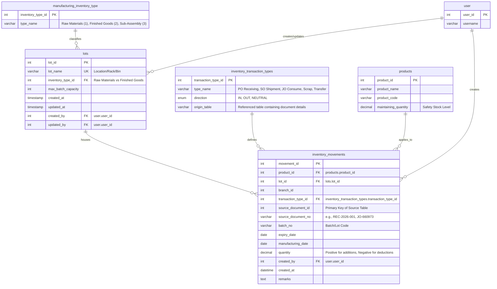
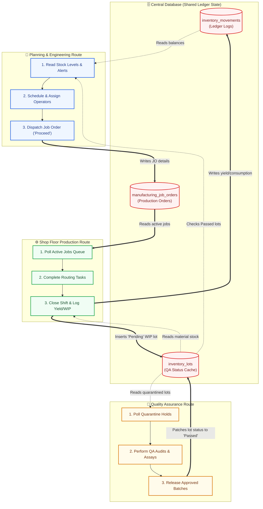

# 📊 Lot Management & Inventory Ledger Control Center

This dashboard and technical documentation file serves as the master guide for the VOS ERP **Lot Management**, **Inventory Transaction Ledger**, and **Inventory Reports** system. It details the underlying database schemas, entity relationships, inventory aggregation algorithms, FIFO/FEFO allocation rules, and visual report designs.

---

## 🖥️ Live Control Center Dashboard (Concept Overview)

| ERP Module Status | Ledger Reconciliation | Active Storage Lots | Ledger Transactions | Engine Mode |
| :---: | :---: | :---: | :---: | :---: |
| `● ONLINE` | `● 100% AUDITED` | `62 Active Bins` | `46 Records` | `FIFO / FEFO` |

### 🎛️ Control Actions Console
*   `[🔍 Search Ledger]` - Audits detailed documents, timestamps, and creator trails.
*   `[📦 Run FEFO Allocator]` - Sequences active inventory batches by soonest expiration.
*   `[📏 Space Capacity]` - Identifies storage capacity bottlenecks and utilization percentages.
*   `[📋 Export PDF]` - Generates Certificate of Analysis (COA) logs for released finished lots.

---

### 📈 Current System KPIs
| Metric | Status | Current Reading | Description |
| :--- | :---: | :---: | :--- |
| **Total Registered Lots (Locations)** | `Active` | **62 Locations** | Bins, racks, and bays configured for item placement. |
| **Total Ledger Movements logged** | `Audited` | **46 Transactions** | Historic receipts, consumption logs, and transfers. |
| **Safety Stock Red Alerts** | `Warning` | **2 Items Below Min** | SKUs whose ledger sum is below their safety threshold. |
| **FEFO Expiry Warnings** | `Action Needed`| **3 Batches** | Lots expiring within the next 30 days. |

---

## 1. 🗄️ Database Architecture & Relationships

The inventory sub-system is designed around a **Transaction Ledger Model**. Rather than relying on simple state column updates, every addition, deduction, or transfer is recorded as a single immutable entry in the `inventory_movements` table. 

### 🧬 Entity Relationship Diagram (ERD)



---

### 📋 Table Dictionaries

#### 1. `lots` Table
This table represents the physical locations, racks, bins, or sections inside the factory branch where items are stored. It does *not* represent a product's manufactured batch (which is stored in `inventory_movements.batch_no`).
*   **`lot_id`** (INT, Primary Key): Unique auto-increment identifier for the storage location.
*   **`lot_name`** (VARCHAR(50), Unique Index): The human-readable name of the location, rack, or bin (e.g. `BIN-A1`, `RACK-04-B`, `Manufacturing Stock`).
*   **`inventory_type_id`** (INT, Foreign Key): References `manufacturing_inventory_type` (e.g., 1 for Raw Materials, 2 for Finished Goods). Ensures compatibility with specific items.
*   **`max_batch_capacity`** (INT, Default 10): The maximum capacity or volume threshold this specific storage lot can accommodate.
*   **`created_by` / `updated_by`** (INT, Foreign Keys): Audit logs referencing the system user who created or last modified the lot metadata.

#### 2. `inventory_movements` Table
This is the core transaction ledger. Every physical adjustment writes a new row here.
*   **`movement_id`** (INT, Primary Key): Unique auto-increment ID.
*   **`product_id`** (INT, Foreign Key): References `products.product_id`. The SKU being moved.
*   **`lot_id`** (INT, Foreign Key): References `lots.lot_id`. The physical warehouse location, rack, or bin where the stock sits.
*   **`branch_id`** (INT): The physical factory branch/warehouse (enabling multi-branch isolation).
*   **`transaction_type_id`** (INT, Foreign Key): References `inventory_transaction_types`. Controls stock directions.
*   **`source_document_id`** (INT): Primary key of the originating record (e.g., a specific `purchase_order_product_id` or `ledger_id` from shift log).
*   **`source_document_no`** (VARCHAR(100)): Human-readable document identifier (e.g., `REC-2026-001` or `JO-660973`) for rapid lookups and cross-referencing.
*   **`batch_no`** (VARCHAR(100)): The manufacturing batch or lot number of the product (e.g. `LOT-2026-07-14`, `B-88390`). Crucial for expiration and traceability.
*   **`expiry_date`** (DATE, Nullable): Expiry target used for **FEFO** (First Expired, First Out) scheduling.
*   **`manufacturing_date`** (DATE, Nullable): Manufacturing date used for **FIFO** (First In, First Out) scheduling.
*   **`quantity`** (DECIMAL(15,4)): The transaction quantity. **Positive** for additions (adds stock), **Negative** for deductions (removes stock).
*   **`remarks`** (TEXT, Nullable): Additional contextual logs regarding the movement.

#### 3. `inventory_transaction_types` Table
Defines the vocabulary and financial/physical direction of inventory operations.
*   **`transaction_type_id`** (INT, Primary Key): Unique identifier.
*   **`type_name`** (VARCHAR(50)): e.g., `PO Receiving`, `SO Shipment`, `JO Consume`, `Scrap`, `Transfer`.
*   **`direction`** (ENUM('IN', 'OUT', 'NEUTRAL')):
    *   `IN`: Adds stock to the warehouse (e.g., PO receiving, finished goods yield entry).
    *   `OUT`: Deducts stock (e.g., Job Order consumption, Sales Order shipment, scrap/spoilage).
    *   `NEUTRAL`: No net inventory impact (used for bin-to-bin transfers within the same warehouse where one record goes OUT and another goes IN, or quality locks).
*   **`origin_table`** (VARCHAR(100)): Defines the source database table to enable automated auditing links.

---

## 2. 🔄 Inventory Movements & Transaction Ledger Engine

### ⚖️ The Ledger-as-Truth Model
Under the ledger model, the on-hand quantity of any product/SKU is never queried from a single static "on_hand" column. Instead, it is computed by summing the transaction history. 

```
[PO Receiving Event]   ────> Write (+100 Qty) to inventory_movements
[JO Consumption Event] ────> Write (-25 Qty) to inventory_movements
[Stock Query]          ────> SUM(quantity) = 75 Qty
```

This guarantees:
1.  **Data Integrity**: Inventory matches transaction history 100% of the time. There is no risk of a data drift.
2.  **Auditability**: Every stock level change has a document trail (`source_document_no`), a timestamp, and an author.

### 📐 Calculating Current Stock Levels
To find the physical stock levels of a product inside a factory branch, run the following ledger query:

```sql
SELECT 
    im.product_id,
    p.product_name,
    p.product_code,
    im.lot_id,
    l.lot_name AS location_name,
    im.batch_no,
    im.expiry_date,
    im.manufacturing_date,
    SUM(im.quantity) AS current_stock
FROM inventory_movements im
JOIN products p ON im.product_id = p.product_id
JOIN lots l ON im.lot_id = l.lot_id
WHERE im.branch_id = :branchId
GROUP BY 
    im.product_id,
    p.product_name,
    p.product_code,
    im.lot_id,
    l.lot_name,
    im.batch_no,
    im.expiry_date,
    im.manufacturing_date
HAVING SUM(im.quantity) > 0;
```

---

## 3. 🚀 FIFO / FEFO Allocation Engine

To enforce strict quality standards and shelf-life compliance, the system supports automated inventory allocation workflows based on FIFO and FEFO rules.

### ⚡ Database Index Optimizations
To prevent slow performance as the `inventory_movements` table grows, the database utilizes two indexes:
1.  **`idx_fefo_allocation`** (`product_id`, `branch_id`, `expiry_date`, `created_at`): 
    *   Optimizes **First Expired, First Out (FEFO)** scheduling.
    *   Sorts expiring batches instantly for perishable ingredients (e.g., flour, oils) without triggering full-table scans.
2.  **`idx_fifo_allocation`** (`product_id`, `branch_id`, `manufacturing_date`, `created_at`):
    *   Optimizes **First In, First Out (FIFO)** scheduling.
    *   Resolves allocations for non-perishable parts and raw packaging.

### ⚙️ FEFO Allocation Query Specification
When allocating raw material inventory to a Job Order, the allocation service executes the following query to identify available batches in FEFO order:

```sql
SELECT 
    im.product_id,
    im.batch_no,
    im.expiry_date,
    im.manufacturing_date,
    im.lot_id,
    l.lot_name AS location_name,
    SUM(im.quantity) AS physical_available
FROM inventory_movements im
JOIN lots l ON im.lot_id = l.lot_id
WHERE 
    im.product_id = :productId 
    AND im.branch_id = :branchId
GROUP BY 
    im.product_id, 
    im.batch_no, 
    im.expiry_date, 
    im.manufacturing_date,
    im.lot_id,
    l.lot_name
HAVING SUM(im.quantity) > 0
ORDER BY 
    im.expiry_date ASC, 
    im.manufacturing_date ASC;
```

---

## 4. 📊 Dashboard Reports & Analytics

The ledger structure supports reporting models without requiring separate database tables. The following reports represent the standard analytical layouts built on the `inventory_movements` and `lots` collections:

### Report 1: Warehouse Lot Space & Capacity Utilization
This report helps warehouse managers identify space constraints by comparing the sum of current inventory in each lot against its `max_batch_capacity`.

| Location ID | Location Name (`lot_name`) | Inventory Type | Current Stock | Max Capacity | Utilization % | Graphical Load Indicator |
| :--- | :--- | :--- | :---: | :---: | :---: | :--- |
| **LOT-01** | `BIN-RAW-01` | Raw Materials | 8,500 | 10,000 | **85.0%** | `[████████░░] High` |
| **LOT-02** | `BIN-RAW-02` | Raw Materials | 2,100 | 10,000 | **21.0%** | `[██░░░░░░░░] Low` |
| **LOT-03** | `RACK-FG-A` | Finished Goods | 9,800 | 10,000 | **98.0%** | `[█████████░] Critical` |
| **LOT-04** | `RACK-FG-B` | Finished Goods | 0 | 10,000 | **0.0%** | `[░░░░░░░░░░] Empty` |

> [!TIP]
> **Utilization Formula**:  
> $$\text{Utilization \%} = \left( \frac{\sum \text{quantity in lot\_id}}{\text{max\_batch\_capacity}} \right) \times 100\%$$

---

### Report 2: Stock Ledger Card Audit Trail (Stock Card)
The ledger card shows a timeline of all inventory movements for a specific SKU. It is used for auditing and debugging inventory discrepancies.

*   **SKU**: `PROD-NOODLE-300G` (Canton Noodles 300g)
*   **Branch**: `Main Plant (Branch ID: 1)`

| Timestamp (`created_at`) | Document Ref (`source_document_no`) | Batch Code (`batch_no`) | Type | Qty In | Qty Out | Running Balance | Logged By |
| :--- | :--- | :--- | :--- | :---: | :---: | :---: | :--- |
| 2026-07-14 09:00 | `REC-2026-010` | `B-EXP2707-A` | PO Receiving | +1,000.00 | | 1,000.00 | Supervisor Admin |
| 2026-07-14 11:30 | `JO-260973` | `B-EXP2707-A` | JO Consume | | -300.00 | 700.00 | Shift Operator |
| 2026-07-14 13:00 | `JO-260974` | `B-EXP2707-A` | JO Consume | | -500.00 | 200.00 | Shift Operator |
| 2026-07-14 14:15 | `SCR-889` | `B-EXP2707-A` | Scrap/Spoilage | | -15.00 | **185.00** | QA Inspector |

---

### Report 3: FEFO Batch Expiration Aging Report
This report lists expiring batches first, allowing warehouse supervisors to dispatch near-expiry lots before they expire.

| Product SKU | Batch Code (`batch_no`) | Location (`lot_name`) | Expiry Date | Days to Expiry | Status | Recommended Action |
| :--- | :--- | :--- | :--- | :---: | :---: | :--- |
| `FLOUR-WHEAT-25KG` | `B-FLR-001` | `BIN-RAW-01` | 2026-08-01 | **18 Days** | `Passed` | **⚠️ Urgent: Dispatch Next** |
| `YEAST-ACT-500G` | `B-YST-092` | `BIN-RAW-02` | 2026-09-15 | **63 Days** | `Passed` | Use standard allocation |
| `PALM-OIL-18L` | `B-OIL-443` | `BIN-RAW-01` | 2026-10-30 | **108 Days** | `Passed` | Store |
| `CANTON-NOOD-300G` | `B-YLD-990` | `RACK-FG-A` | 2027-01-20 | **190 Days** | `QA Hold` | Awaiting QA clearance |

---

## 5. 🛠️ API & BFF Implementation Specification

### 1. Retrieve Current Lot Space Utilization
*   **Endpoint**: `GET /api/manufacturing/inventory/lots/utilization`
*   **Response Payload**:
```json
[
  {
    "lot_id": 1,
    "lot_name": "BIN-RAW-01",
    "inventory_type": "Raw Materials",
    "current_stock": 8500.0000,
    "max_batch_capacity": 100000,
    "utilization_percent": 8.5
  },
  {
    "lot_id": 2,
    "lot_name": "RACK-FG-A",
    "inventory_type": "Finished Goods",
    "current_stock": 9800.0000,
    "max_batch_capacity": 10000,
    "utilization_percent": 98.0
  }
]
```

### 2. Log Inventory Movement (Ledger Entry)
*   **Endpoint**: `POST /api/manufacturing/inventory/movements`
*   **Request Payload**:
```json
{
  "product_id": 12,
  "lot_id": 2,
  "branch_id": 1,
  "transaction_type_id": 1,
  "source_document_id": 994,
  "source_document_no": "JO-260973",
  "batch_no": "B-YLD-20260714",
  "expiry_date": "2027-07-14",
  "manufacturing_date": "2026-07-14",
  "quantity": -150.0000,
  "created_by": 24,
  "remarks": "Raw flour consumption for Job Order JO-260973 yield logs."
}
```
*   **Response Payload**:
```json
{
  "success": true,
  "message": "Inventory movement transaction logged successfully.",
  "movement_id": 46
}
```

---

## 6. 🔄 Concurrent Operational Lifecycle Flowchart

Since the **Planning**, **Shop Floor Production**, and **Quality Assurance** modules run concurrently (e.g., planners queue new orders while operators run existing batches and QA inspectors clear completed lots), they coordinate asynchronously through the shared database ledger state.


