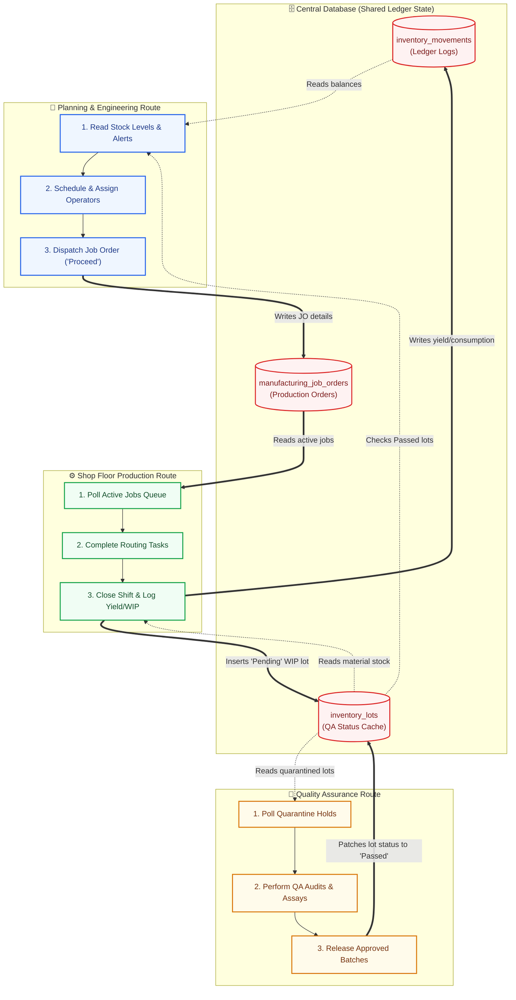

# 📋 Production, Shop Floor, & Quality Assurance Workflow Guide

This document details the concurrent operational lifecycle of the VOS ERP system across **Planning & Scheduling**, **Shop Floor Execution**, and **Quality Assurance (QA)**. It maps how these parallel modules communicate asynchronously through a shared database ledger.

---

## 🔄 Concurrent Operational Lifecycle

```
========================================================================================
  VOS MANUFACTURING  |  CONCURRENT WORKFLOW MANAGEMENT  |  LEAN STACK SYNC
========================================================================================
  [PLANNING LANE: Active]     [PRODUCTION LANE: Active]     [QUALITY ASSURANCE: Active]
========================================================================================
```

### 🧬 Data-Flow & Concurrency Architecture

In a live factory environment, Planners, Operators, and QA Inspectors perform tasks in parallel. The flowchart below illustrates how these three concurrent routes interface with the shared relational database state.



---

## 🛠️ Step-by-Step Phase Breakdown

### 1. 📐 Planning & Scheduling
*   **Access Route**: `/mm/planning-engineering`
*   **Key Source Files**:
    *   Frontend View: [PlanningEngineeringModule.tsx](file:///C:/Users/Admin/WebstormProjects/manufacturing-management/src/modules/manufacturing-management/planning-engineering/PlanningEngineeringModule.tsx)
    *   BFF Logic Helper: [inventory-helper.ts](file:///C:/Users/Admin/WebstormProjects/manufacturing-management/src/app/api/manufacturing/planning-engineering/helpers/inventory-helper.ts)

| Step | Action Name | System Operation | Database Interaction |
| :---: | :--- | :--- | :--- |
| **01** | **Check Shortages** | Reads safety stocks (`maintaining_quantity`) and explodes BOM demand. | Queries sum of `inventory_movements` filtered by branch & `Passed` lots. |
| **02** | **Consolidate** | Groups pending sales demands or creates raw material buffer jobs. | Prepares draft job order schedules. |
| **03** | **Dispatch** | Assigns operator personnel to routing sequences and dispatches job. | Updates `manufacturing_job_orders.status` to `'Proceed'`. |

---

### 2. ⚙️ Shop Floor Production (Production Workflow)
*   **Access Route**: `/mm/production-workflow`
*   **Key Source Files**:
    *   Frontend View: [JobOrderShiftLogModal.tsx](file:///C:/Users/Admin/WebstormProjects/manufacturing-management/src/modules/manufacturing-management/production-workflow/components/JobOrderShiftLogModal.tsx)
    *   BFF Closure API: [shift-run-log/route.ts](file:///C:/Users/Admin/WebstormProjects/manufacturing-management/src/app/api/manufacturing/production/shift-run-log/route.ts)

| Step | Action Name | System Operation | Database Interaction |
| :---: | :--- | :--- | :--- |
| **01** | **Routing Progress** | Operators check into sequence tasks, recording run and machine hours. | Inserts progress tracking logs. |
| **02** | **Step QA Gates** | Inspectors clear pH, weight, or moisture checks before unlocking next steps. | Writes step verification checks to QA checklist table. |
| **03** | **Shift Closing** | Supervisor enters batch code (`batch_no`), yield qty, and actual raw consumed. | Inserts consumption logs (`-quantity`) and yield outputs (`+quantity`) to `inventory_movements` ledger; adds new snapshot lot to `inventory_lots` with `Pending` status. |

---

### 3. 🧪 Quality Control & Final Release
*   **Access Route**: `/mm/manufacturing-qa`
*   **Key Source Files**:
    *   Frontend View: [FinalQAReleases.tsx](file:///C:/Users/Admin/WebstormProjects/manufacturing-management/src/modules/manufacturing-management/manufacturing-qa/components/FinalQAReleases.tsx)
    *   BFF Release API: [final-qa/route.ts](file:///C:/Users/Admin/WebstormProjects/manufacturing-management/src/app/api/manufacturing/production/final-qa/route.ts)

| Step | Action Name | System Operation | Database Interaction |
| :---: | :--- | :--- | :--- |
| **01** | **Quarantine Poll** | Displays recently completed production batches waiting for QC release. | Queries `inventory_lots` where `qa_status` is `Pending` or `QA Hold`. |
| **02** | **QA Audits** | QA inspector logs microbiological assays, seal strengths, and label checks. | Saves checklist audit logs to `manufacturing_final_qa_releases`. |
| **03** | **Batch Release** | Supervisor approves the batch. This unlocks the stock for inventory shipments. | Patches `inventory_lots.qa_status` to `Passed` (or `Failed` if rejected), enabling it to be allocated by Planning. |
