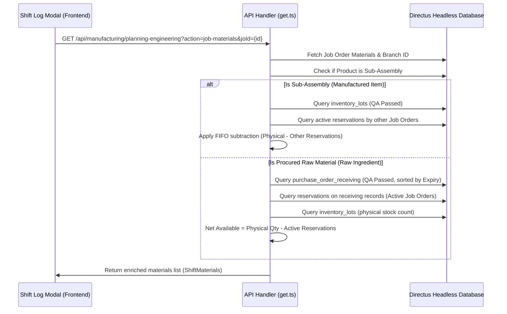

# Raw Material Consumption Reconciliation: Inventory Fetching Specification

This document details the architecture, sequence, and logic used by the VOS ERP system to retrieve available stock, lot allocations, and material reservations during the **Raw Material Consumption Reconciliation** step of a shift run log closure.

---

## 1. Process Flow Overview

When an operator or supervisor opens the **Log Shift / Daily Yield** modal, the frontend initiates a request to resolve the required Bill of Materials (BOM) items and calculate their physical, reserved, and net available stock.



---

## 2. Database Schema & Relationships

The calculation depends on five main database tables in Directus:

1.  **`manufacturing_job_orders`**: Holds the parent Job Order meta, status, and `branch_id`.
2.  **`manufacturing_job_order_materials`** (`mData`): List of raw materials allocated to this specific Job Order, containing `product_id`, `allocated_quantity`, and `reserved_quantity`.
3.  **`inventory_lots`**: Tracks physical physical quantities currently sitting in warehouse/floor locations, containing `quantity`, `qa_status` ("Passed"), `branch_id`, and `source_type` ("procurement" or "manufacturing").
4.  **`purchase_order_receiving`**: Logs PO receipt events for incoming materials, containing `lot_no`, `batch_no`, `expiry_date`, and `receipt_no`.
5.  **`manufacturing_job_order_materials_reservations`**: Maps specific Job Order material needs to a receipt record, locking down a `reserved_quantity`.

---

## 3. Detailed Fetching Logic (BFF Level)

The logic resides in [`src/app/api/manufacturing/planning-engineering/handlers/get.ts`](file:///C:/Users/Admin/WebstormProjects/manufacturing-management/src/app/api/manufacturing/planning-engineering/handlers/get.ts) under the `action === "job-materials"` condition.

### Step 3.1: Material & Branch Identification
*   **Job Order Branch**: Retrieves the `branch_id` from the Job Order to ensure inventory is only pulled from the same physical factory branch.
*   **BOM Retrieval**: Fetches all materials linked to the Job Order from `manufacturing_job_order_materials`.

### Step 3.2: Sub-Assembly vs. Procured Resolution
For each material product ID, the endpoint queries the active routing version (`getActiveVersionForProduct`). If a recipe version exists, the item is processed as a **Sub-Assembly**; otherwise, it is treated as a standard **Procured Raw Material**.

#### Path A: Sub-Assembly Inventory Logic
1.  **Fetch Physical Lots**: Queries `inventory_lots` where `product_id` matches, `branch_id` matches, and `qa_status === "Passed"`.
2.  **Fetch Other Job Order Bookings**: Queries reservations allocated by *other* active Job Orders (status in `Proceed`, `Ongoing`, `On Hold`, `Released`, `In Progress`) for the same sub-assembly:
    ```sql
    SELECT SUM(reserved_quantity) 
    FROM manufacturing_job_order_materials
    WHERE product_id = :productId AND job_order_id.status IN ('Proceed', 'Ongoing', 'On Hold', 'Released', 'In Progress') AND job_order_id != :currentJoId
    ```
3.  **FIFO Allocation Subtraction**:
    *   Iterates through physical sub-assembly lots.
    *   Subtracts the sum of reservations by other Job Orders from the lot physical quantities in sequence.
    *   The remaining quantity is defined as `available`.

#### Path B: Procured Raw Material Inventory Logic
1.  **Fetch QA Passed Receipts**: Queries `purchase_order_receiving` matching the product and branch, sorted by `expiry_date` (earliest expiry first / FEFO).
2.  **Fetch Global Reservations**: Queries all reservations made on these receipt records by active Job Orders (status in `Proceed`, `Ongoing`, `On Hold`):
    ```sql
    SELECT purchase_order_receiving_id, SUM(reserved_quantity)
    FROM manufacturing_job_order_materials_reservations
    WHERE purchase_order_receiving_id IN (:receiptIds)
    GROUP BY purchase_order_receiving_id
    ```
3.  **Fetch Physical Inventory Lots**: Queries `inventory_lots` for `source_type === "procurement"` to find the actual remaining physical stock level for each lot.
4.  **Net Availability Calculation**:
    *   For each candidate receipt lot, matches its physical inventory lot.
    *   Calculates `netAvailable = physicalQty - alreadyReservedByOtherJobs`.
    *   Filters out lots where `netAvailable <= 0` (unless a reservation is explicitly locked for the current Job Order).

---

## 4. Frontend Reconciliation & Deviations

Once the frontend receives the list, it binds it to the `shiftMaterials` state in [`JobOrderShiftLogModal.tsx`](file:///C:/Users/Admin/WebstormProjects/manufacturing-management/src/modules/manufacturing-management/production-workflow/components/JobOrderShiftLogModal.tsx#L120-L127). The UI performs the following calculations in real time as the supervisor enters actual usage:

### A. Standard Allocation (Theoretical Usage)
Theoretical usage is scaled proportionally based on the current shift's yield output:
$$\text{Theoretical Usage} = \left( \frac{\text{Total Material Allocated to JO}}{\text{Total Target JO Quantity}} \right) \times \text{Current Shift Yield}$$

### B. Deviation Percentage
Calculates how closely actual consumption matches standard expectations:
$$\text{Deviation \%} = \left( \frac{\text{Actual Usage}}{\text{Theoretical Usage}} \right) \times 100\%$$

### C. Status Warnings
*   **Normal**: Actual usage is within $\pm 5\%$ of standard.
*   **Over-limit**: Actual usage exceeds theoretical expectation by $> 5\%$ (turns input border amber).
*   **Shortfall (Shortage)**: Actual entered usage exceeds `available_stock` (turns input border red, blocks submission until resolved or overridden).
