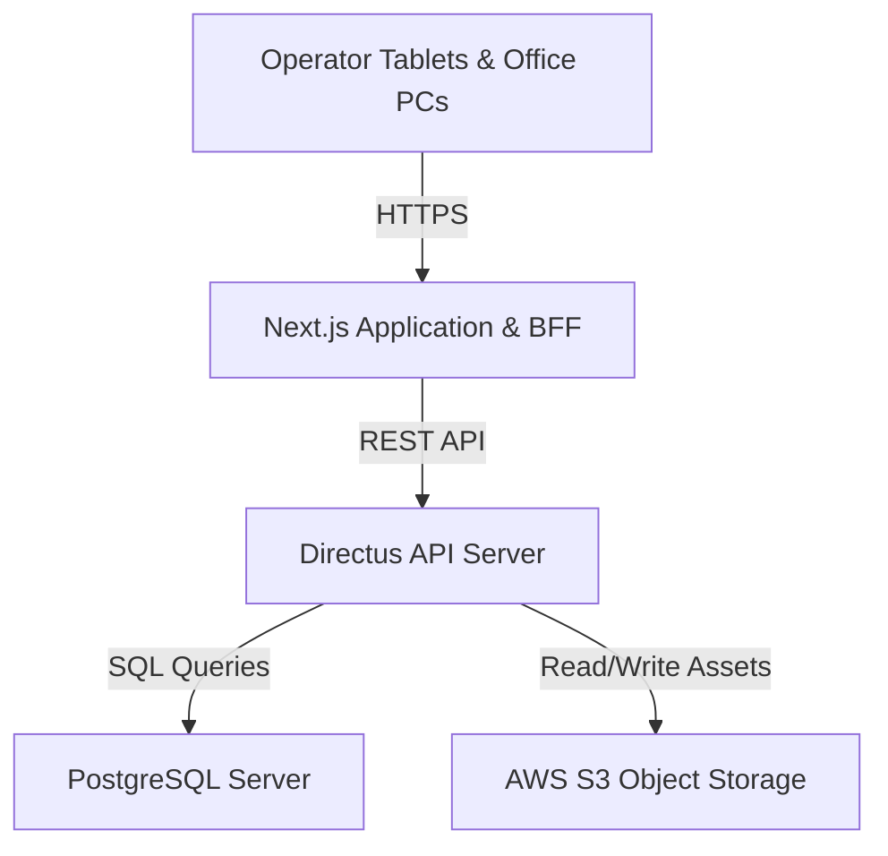

# Infrastructure, Devices, & Network Recommendations

This document outlines the recommended hardware specifications, operator devices, and network requirements for running the **VOS ERP Manufacturing Management System** in a production environment.

---

## 1. Server Infrastructure Specs

The application stack consists of:
1. **Next.js Web Client & BFF (Backend-For-Frontend)** running on Node.js.
2. **Directus Headless CMS (REST/GraphQL API Engine)**.
3. **PostgreSQL Database** for transactional data storing.
4. **Object Storage Service** (e.g., AWS S3) for assets (QA photos, PDF uploads).

### Recommended Deployments

### Hosting Options

#### Option A: Cloud Hosting (Recommended)
Cloud hosting provides automated scaling, high availability, and easy backups.

| Component | Service (AWS Example) | CPU/vCPU | RAM | Storage | Purpose |
| :--- | :--- | :---: | :---: | :--- | :--- |
| **Database Server** | AWS RDS PostgreSQL | 4 vCPU | 16 GB | 100 GB NVMe (gp3) | Handles transaction processing, indexing, and locks. |
| **App Server** (NextJS + Directus) | AWS EC2 (t3.xlarge) | 4 vCPU | 16 GB | 50 GB SSD | Runs the node API engine and renders the frontend. |
| **Asset Storage** | AWS S3 | - | - | Pay-as-you-use | Stores QA photo uploads, manifests, and PDF templates. |

#### Option B: On-Premise Server (Private Local Server)
If deployment must reside locally inside the factory server rack (e.g. for low latency or compliance):

- **CPU**: Intel Xeon E-2300 series (6 Cores / 12 Threads) or AMD EPYC 7003 Series.
- **RAM**: 32 GB DDR4 ECC RAM (split: 12GB for PostgreSQL buffers, 12GB for Docker containers/Node hosts, 8GB overhead).
- **Storage**: Enterprise-grade RAID 10 SSD/NVMe (minimum 500GB usable space).
- **Backup**: Dedicated External NAS or Automated nightly S3/Cloud offsite backup.
- **UPS**: Minimum 1500VA uninterruptible power supply with automatic shutdown integration.

---

## 2. Hardware Devices by Workstation

Different areas of the factory require tailored devices for ease-of-use and durability.

### A. Shop Floor & Operator Workstations
Used by assembly staff, welders, packers, and inspectors.

*   **Primary Device**: Ruggedized 10-inch Android/Windows Tablets.
    *   *Examples*: **Samsung Galaxy Tab Active4 Pro** or **Lenovo Tab K10 Rugged**.
    *   *Features*: IP68 dust/water protection, drop-tested casing, anti-glare screen.
*   **Mounting**: VESA magnetic arm mounts at each production station (attached to walls or workbench beams) to keep devices clean from factory grease.
*   **Peripherals**:
    *   Industrial Bluetooth/USB Barcode scanners (e.g. **Zebra LS2208** or **Zebra DS2278** wireless) for scanning raw materials into batch processes and checking QA lot numbers.

### B. Warehouse Receiving & Logistics Dispatch
Used by warehouse personnel for material check-in, duties audit, and manifest receipts.

*   **Primary Device**: Rugged Handheld Barcode Mobile Computers.
    *   *Examples*: **Zebra TC21 / TC26** or **Honeywell ScanPal EDA52**.
    *   *Features*: Integrated physical scanner, single-handed operation, highly drop-resistant, long battery life (hot-swappable).

### C. Office & Administrative Terminals
Used by Production Planners, Sales Coordinators, Procurement Managers, and Finance Executives.

*   **Primary Device**: Mid-range Business Laptops or All-in-One Desktops.
    *   *Specs*: Intel Core i5/Ryzen 5, 16 GB RAM, 256 GB SSD, 21-inch+ Full HD monitor (critical for viewing large spreadsheets, BOM structures, and batch consolidation tables).

---

## 3. Internet Speed & Connectivity Requirements

Because the ERP performs real-time database locks, daily breakdown syncs, and uploads high-resolution QA photos, robust connection speed and reliability are crucial.

### Bandwidth Recommendation (Assuming 50–150 Active Devices)

*   **Symmetric Bandwidth (Upload & Download)**:
    *   **Main Office & Plant**: **50 Mbps Symmetric** (1:1 dedicated leased line / Business Fiber).
    *   **Secondary Warehouses**: **20 Mbps Symmetric**.
    *   *Note*: Standard consumer connections are often asymmetric (e.g., 200Mbps download but only 10Mbps upload). Ensure business-grade upload capacity is configured, as photo uploads can otherwise saturate the network.
*   **Latency**:
    *   A ping latency of **`< 50ms`** to the cloud server is optimal for smooth dropdown loads and form submit updates.
*   **Quality of Service (QoS)**:
    *   Configure the local router to prioritize ERP traffic (matching URLs `/api/*`) over entertainment traffic (video streaming, social media) to guarantee workstation responsiveness during peak operational hours.

### Network Redundancy (Failover)
To prevent production from halting if the primary fiber connection drops:

1.  **Dual-WAN Security Router**: Install a router that supports automatic failover (e.g., **Ubiquiti UniFi Dream Machine** or **Cisco Meraki MX**).
2.  **Backup ISP Link**:
    *   Connect a secondary, cheap broadband link from a different carrier.
    *   Alternatively, use a **5G/LTE Business Gateway** (e.g., **Cradlepoint** or **Teltonika RUT950** with an industrial SIM card). The router will automatically switch to the cellular backup within seconds of a fiber outage.
