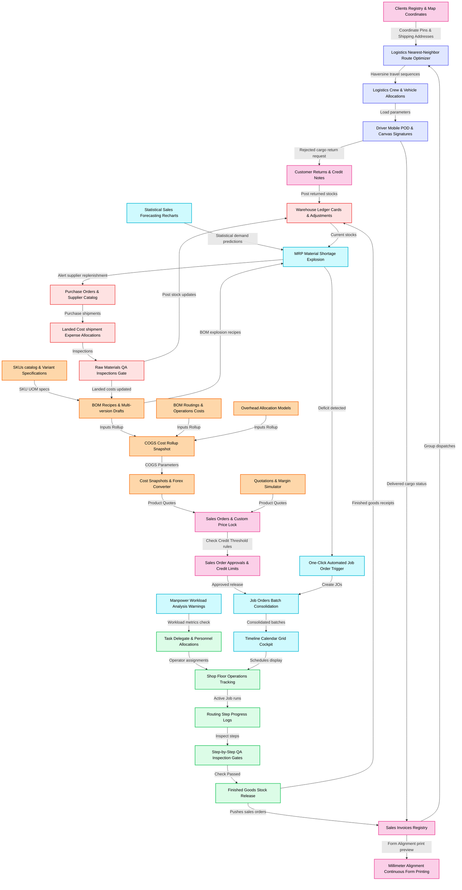

# Architectural & Functional Overview: VOS Manufacturing & Logistics Management System

Use this document as the single source of truth for generating user guides, developer onboarding documentation, API specifications, and database collections dictionaries.

---

## 🛠️ Technological Foundation & Stack

*   **Frontend Framework**: Next.js 16 (React 19, Server & Client Components, App Router).
*   **Design & Styling**: Custom Vanilla Tailwind CSS with custom micro-animations (pulsing geo-nodes, sliding slide-out sheets, active state loaders, dynamic charts) for high-fidelity aesthetics. Includes a custom styling theme system supporting Light/Dark/System appearance, accent color themes, rounded corner boundary ratios, and UI densities.
*   **Visualizations**: Recharts data engine for demand forecasting, inventory charts, and historical sales analytics.
*   **Mapping & Geolocation**: Maplibre-GL canvas rendering with CartoDB keyless basemaps, OSM Nominatim Geocoder search autocompletes, and Esri raster satellite imagery toggles.
*   **Database & API Layer**: Headless Directus CMS (running on PostgreSQL/MySQL) serving RESTful endpoints secured via static JWT bearer tokens.
*   **Core Helper Libraries**: Lucide React icons, Sonner toast notifications, HTML5 Geolocation API, HTML5 Canvas signature capture pads.
*   **Print Engine**: Sandboxed `<iframe>` layout builders rendering dynamic continuous invoices without blocking visual main threads, with printer calibration configurations.
*   **PDF Generation**: jspdf and jspdf-autotable engine running with reusable company template structures.

---

## 🔄 Core Functional Modules Breakdown

### 1. Sales Forecasting & Material Shortage Explosion (MRP)
*   **Route**: `/mm/bi-and-financials` (Implemented in [BiAndFinancialsModule.tsx](file:///C:/Users/Admin/WebstormProjects/manufacturing-management/src/modules/manufacturing-management/bi-and-financials/BiAndFinancialsModule.tsx))
*   **Historical Sales Trend Integration**: Compiles actual historical monthly sales volume and return transactions from database invoicing endpoints. In the absence of live records, utilizes product SKU characteristics to seed consistent simulated histories.
*   **Statistical Forecasting Algorithms**:
    *   **Simple Moving Average (SMA)**: Computes a rolling mean of sales demand across a configurable range of preceding months.
    *   **Exponential Smoothing**: Applies an alpha coefficient (adjustable from `0.0` to `1.0` via slider controls) to weight recent periods against preceding estimates. Formula: $S_t = \alpha Y_{t-1} + (1 - \alpha) S_{t-1}$.
    *   **Seasonal Extrapolations**: Projects demand patterns based on recurring peaks, modified by a configurable demand multiplier.
*   **Material Shortage Explosion (MRP)**:
    *   Computes the projected 30-day and 90-day finished goods production deficit (Projected Demand - Current Warehouse Stock).
    *   Resolves parent BOM recipes and auto-scales raw materials components for child package variants based on unit-of-measurement multipliers.
    *   Applies component waste adjustments (`wastagePercent` factors) to calculate exact gross input volumes.
    *   Cross-references component requirements against real-time raw materials inventory levels, flagging red-alert shortages for ingredients.
*   **Automated Forecast Job Order Dispatcher**: Provides a single-click action to bulk-dispatch Forecast Job Orders (`JO-FORECAST-XXXX`) to resolve deficits.

### 2. Product Master SKUs & Bill of Materials (BOM) Recipe Engine
*   **Route**: `/mm/finished-goods` (Implemented in [FinishedGoodsModule.tsx](file:///C:/Users/Admin/WebstormProjects/manufacturing-management/src/modules/manufacturing-management/finished-goods/FinishedGoodsModule.tsx))
*   **SKU Catalog Management**: Details item listings, barcode specifications, safety stock levels, product classifications (brand, category, class, segment, shelf-life), and base unit measurements.
*   **BOM Recipe Tab**: (Implemented in [BOMRecipeTab.tsx](file:///C:/Users/Admin/WebstormProjects/manufacturing-management/src/modules/manufacturing-management/finished-goods/components/BOMRecipeTab.tsx))
    *   Registers component lists under specific states (draft vs. active versioning, e.g. V1, V2).
    *   Tracks component roles: `raw_material`, `sub_assembly`, or `by_product` (credited back as negative cost factors).
    *   Specifies input quantity, physical density metrics, landed unit cost, and scrap wastage percentages.
*   **Operations Routings Tab**: (Implemented in [RoutingsTab.tsx](file:///C:/Users/Admin/WebstormProjects/manufacturing-management/src/modules/manufacturing-management/finished-goods/components/RoutingsTab.tsx))
    *   Maps sequential routing steps (e.g. Mixing, Baking, QA Inspection) to machine work centers.
    *   Computes operation costs: $\text{Labor Cost} + (\text{Machine Hourly Rate} \times \text{Cycle Duration Hours})$.
*   **Overhead Margins Allocation**: Integrates administrative, logistical, and QA overhead category values (fixed amounts or percentages) to products.
*   **Cost Rollup tab**: (Implemented in [CostRollupTab.tsx](file:///C:/Users/Admin/WebstormProjects/manufacturing-management/src/modules/manufacturing-management/finished-goods/components/CostRollupTab.tsx))
    *   Aggregates total material costs, routing run costs, and overhead margins to compile standard Cost of Goods Sold (COGS).
*   **Multi-Scenario Margin Simulator**: Lets engineers adjust simulated yield percentages, targeted selling prices, forex exchange adjustments (USD/PHP), and landed cost overrides to view profit margins in real time, with links to export parameters as a customer quotation.

### 3. Task Planning, Allocations, & Job Order Consolidation
*   **Route**: `/mm/planning-engineering` (Implemented in [PlanningEngineeringModule.tsx](file:///C:/Users/Admin/WebstormProjects/manufacturing-management/src/modules/manufacturing-management/planning-engineering/PlanningEngineeringModule.tsx))
*   **Batch Consolidation**: (Implemented in [BatchConsolidationTable.tsx](file:///C:/Users/Admin/WebstormProjects/manufacturing-management/src/modules/manufacturing-management/planning-engineering/components/BatchConsolidationTable.tsx))
    *   Consolidates multiple pending Sales Orders (1:N mapping) into unified production batch runs, reducing machine cleaning and setup times.
*   **Manpower Workload Analysis**: (Implemented in [ManpowerWorkloadAnalysis.tsx](file:///C:/Users/Admin/WebstormProjects/manufacturing-management/src/modules/manufacturing-management/planning-engineering/components/ManpowerWorkloadAnalysis.tsx))
    *   Aggregates total operation durations from scheduled Job Orders.
    *   Maps total assigned workload hours per operator user against threshold capacities (e.g. standard 40-hour limit).
    *   Raises capacity warning alerts for over-allocated employees and isolates unassigned routing steps.
*   **Task Delegate Allocations**: Form controls inside [PlanningSidebarForm.tsx](file:///C:/Users/Admin/WebstormProjects/manufacturing-management/src/modules/manufacturing-management/planning-engineering/components/PlanningSidebarForm.tsx) allow scheduling engineers to delegate specific operators to individual routing tasks in the Job Order.
*   **Job Orders Registry**: (Implemented in [JobOrdersList.tsx](file:///C:/Users/Admin/WebstormProjects/manufacturing-management/src/modules/manufacturing-management/planning-engineering/components/JobOrdersList.tsx))
    *   Controls status states (Draft, Scheduled, Released, Cancelled) and triggers job release commands.

### 4. Operations Calendar of Schedule Cockpit
*   **Route**: `/mm/calendar-of-schedule` (Implemented in [CalendarOfScheduleModule.tsx](file:///C:/Users/Admin/WebstormProjects/manufacturing-management/src/modules/manufacturing-management/calendar-of-schedule/CalendarOfScheduleModule.tsx))
*   **Timeline Calendar Grid**: (Implemented in [CalendarGrid.tsx](file:///C:/Users/Admin/WebstormProjects/manufacturing-management/src/modules/manufacturing-management/calendar-of-schedule/components/CalendarGrid.tsx))
    *   A monthly dashboard displaying scheduled production Job Orders and incoming cargo shipments.
    *   Filters display elements by All Schedules, Job Orders Only, or Incoming ETAs.
    *   Color-codes event pills: green indicates normal scheduling, red highlights material deficits, and sky-blue indicates shipments.
*   **Slide-Out Details Panel**: (Implemented in [ScheduleDetailsPanel.tsx](file:///C:/Users/Admin/WebstormProjects/manufacturing-management/src/modules/manufacturing-management/calendar-of-schedule/components/ScheduleDetailsPanel.tsx))
    *   Renders details (quantities, assigned staff, status, routing operations) on calendar event clicks.

### 5. Shop Floor Production Workflow & QA Checklist Inspection Gates
*   **Route**: `/mm/production-workflow` (Implemented in [ProductionWorkflowModule.tsx](file:///C:/Users/Admin/WebstormProjects/manufacturing-management/src/modules/manufacturing-management/production-workflow/ProductionWorkflowModule.tsx))
*   **Routing Step Progress logs**: Monitors operations progress from Scheduled ➔ In Production ➔ Completed. Operators log actual run times, scrap metrics, operator credentials, and machine run hours.
*   **Task QA Inspection Gates**: Enforces a strict quality control gate at each routing operation step. Steps require a QA Inspector check-off (Passed vs Pending status) before operators can proceed to subsequent routing steps.
*   **Finished Goods Release**: Completing the final routing step updates inventory ledger cards and advances the parent Sales Order status to `For Invoicing`.

### 6. Geolocation Mapping & Customer Registries
*   **Route**: `/mm/clients` (Implemented in [ClientFormModal.tsx](file:///C:/Users/Admin/WebstormProjects/manufacturing-management/src/modules/manufacturing-management/clients/components/ClientFormModal.tsx))
*   **PSGC Address Droplist**: Integrates cascading selector menus using the Philippine Standard Geographic Code (Province ➔ City/Municipality ➔ Barangay).
*   **Interactive Geolocation Selector**: (Implemented in [CustomerMapSelector.tsx](file:///C:/Users/Admin/WebstormProjects/manufacturing-management/src/modules/manufacturing-management/clients/components/CustomerMapSelector.tsx))
    *   Embeds an interactive Maplibre-GL canvas widget inside the address modal.
    *   Allows click-to-pin mapping and draggable marker coordinates mapping.
    *   Synchronizes typed latitude/longitude coordinates to pan the marker, and marker movements to populate input boxes.
    *   **Autocomplete Search**: Integrates OSM Nominatim Geocoding API searches for instant address positioning.
    *   **Satellite Layer Switcher**: Toggles basemaps between CartoDB street maps and Esri raster satellite imagery.

### 7. Logistics Dispatch & Nearest-Neighbor Route Optimization
*   **Route**: `/mm/deliveries` (Implemented in [DeliveriesModule.tsx](file:///C:/Users/Admin/WebstormProjects/manufacturing-management/src/modules/manufacturing-management/deliveries/DeliveriesModule.tsx))
*   **Nearest-Neighbor Route Optimizer**:
    *   Allows delivery schedulers to group unpaid or unfulfilled invoices into a dispatch plan.
    *   Triggers the "Auto-Optimize Route" command, which uses customer latitude/longitude coordinates and Haversine equations to sequence stops to minimize travel distances.
*   **Crew & Capacity Allocations**: (Implemented in [CreateDispatchModal.tsx](file:///C:/Users/Admin/WebstormProjects/manufacturing-management/src/modules/manufacturing-management/deliveries/components/CreateDispatchModal.tsx))
    *   Assigns vehicles (monitoring load limits), drivers, and logistics helpers.
*   **Driver Mobile View & proof of Delivery (POD)**: (Implemented in [DispatchDetailModal.tsx](file:///C:/Users/Admin/WebstormProjects/manufacturing-management/src/modules/manufacturing-management/deliveries/components/DispatchDetailModal.tsx))
    *   Renders a mobile-responsive sequence list for drivers.
    *   Includes image capture uploads, delivery status overrides, and canvas-based digital signatures.

### 8. Purchase Orders, QA Receiving Gates, & Expenses
*   **Route**: `/mm/procurement` (Implemented in [ProcurementModule.tsx](file:///C:/Users/Admin/WebstormProjects/manufacturing-management/src/modules/manufacturing-management/procurement/ProcurementModule.tsx))
*   **Procurement PO**: Manages suppliers, handles re-order parameters, and automatically initiates PO drafts when raw materials fall below safety thresholds.
*   **QA Receiving Gate**: (Implemented in `/mm/qa-receiving`)
    *   Enforces test verification checklists (dimensions, purity, weight) on incoming materials before release to raw storage bins.
*   **Shipment Expenses & Landed Costs**: (Implemented in `/mm/shipment-expenses`)
    *   Allocates freight, duties, haulage, and brokerage expenses to raw material shipments to calculate landed unit costs.

### 9. Sales Invoicing & Printer Calibrations
*   **Route**: `/mm/invoices` (Implemented in [InvoiceDetailModal.tsx](file:///C:/Users/Admin/WebstormProjects/manufacturing-management/src/modules/manufacturing-management/invoices/components/InvoiceDetailModal.tsx))
*   **Status Tracking**: Monitors payment stages (Paid, Partially Paid, Unpaid, Cancelled) and records cash/check/transfer collections.
*   **Lazy Loading Optimization**: defers loading heavy product line items until the details modal is opened, speeding up initial page loads.
*   **Iframe Printing & alignment Calibration**:
    *   Spawns a clean, sandboxed `<iframe>` to write HTML document markup and trigger print actions, avoiding WebGL/canvas-blocking freezes.
    *   Allows users to calibrate continuous form print alignments by setting X/Y millimeter offset values.

### 10. Warehousing, UOM, Returns, & Settings
*   **Inventory Ledgers**: (Implemented in `/mm/inventory`) Records stock movements (`product_ledger` database collection) and tracks inventory adjustments with reason codes.
*   **UOM Conversions Engine**: (Implemented in [UOMConversionsModule.tsx](file:///C:/Users/Admin/WebstormProjects/manufacturing-management/src/modules/manufacturing-management/uom-conversions/UOMConversionsModule.tsx)) Custom conversions with density settings (e.g. Metric Tons ➔ Liters).
*   **Quotations & Cost Snapshots**: Saves simulated prices, forex conversion tables, and historical costing snapshots.
*   **Sales Returns**: (Implemented in `/mm/sales-return`) Tracks item returns, generates customer credit notes, and updates inventory levels.
*   **Theme & Security Settings**: (Implemented in [settings-appearance.tsx](file:///C:/Users/Admin/WebstormProjects/manufacturing-management/src/app/(manufacturing-management)/mm/settings/settings-appearance.tsx) and `/mm/change-password`) Sets appearance modes, accent colors, spacing densities, and credentials.
*   **Login Activities Audits**: (Implemented in `/mm/login-activity`) Tracks user login histories, device agents, and IP addresses.
*   **PDF Template Frame Tester**: (Implemented in [PdfTestPage.tsx](file:///C:/Users/Admin/WebstormProjects/manufacturing-management/src/app/(manufacturing-management)/mm/pdf-test/page.tsx)) Previews PDF layouts generated by the shared PdfEngine.

---

## 📈 System Workflow & State-Engine Connections

The diagram below maps how these modules interact across the sales, design, scheduling, floor, QA, warehousing, and delivery pipelines:

---
